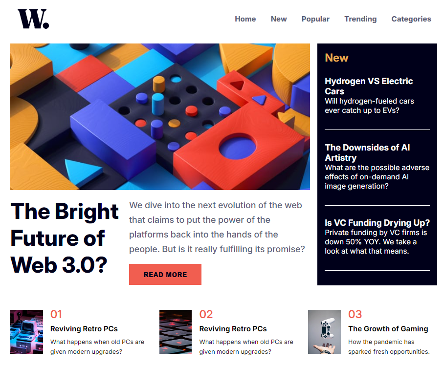

# Frontend Mentor - News homepage solution

Este projeto é uma solução do desafio: [News homepage challenge on Frontend Mentor](https://www.frontendmentor.io/challenges/news-homepage-H6SWTa1MFl).

## Conteúdo

- [O desafio](#o-desafio)
- [Screenshot](#screenshot)
- [Feito com](#feito-com)
- [Aprendizado](#aprendizado)
- [Links](#links)
- [Autor](#autor)

### O desafio:

- A página deve ser responsiva, além de trocar os menus de navegação entre mobile e desktop

### Screenshot:

### Feito com:

- HTML
- CSS
- Flexbox
- Mobile-first workflow
- Javascript

### Aprendizado:

Este desafio mostrou o quanto a constância é importante, antes eu teria sofrido ao realizar, hoje foi mais fácil, mesmo me desafiando a realizá-lo sem utilizar React.

### Links:

- Solution URL: [Add solution URL here](https://github.com/allesonsales/news-homepage)
- Live Site URL: [Add live site URL here](https://allesonsales.github.io/news-homepage)

## Autor:

- [Portfólio](https://allesonsales.github.io/port/)
- Frontend Mentor - [@allesonsales](https://www.frontendmentor.io/profile/allesonsales)
